  

  

# 🧬 About Cortex AI Lab

Located within the **Department of Robotics and Mechatronics Engineering** at the **University of Dhaka**, Cortex AI Lab stands at the cutting edge of applied artificial intelligence. We pioneer innovative solutions at the intersection of:

-   🏥 **Biomedical AI** - Advancing healthcare through intelligent systems
-   🎯 **Multi-Modal Learning** - Integrating diverse data modalities
-   🔬 **Self-Supervised Learning** - Unlocking patterns without labels
-   🌐 **3D Scene Understanding** - Perceiving and interpreting spatial data
-   🐢 **Bio-Inspired Robotics** - Nature-inspired robotic solutions

### 🤝 Prestigious Collaborations
We proudly partner with:
- **National Institute of Cardiovascular Diseases**
- **Combined Military Hospital (CMH)**
- **Multiple departments within University of Dhaka**

> *Join us as we innovate for a healthier and smarter future.*

  

# 🔥 Latest News & Updates

<table align="center" border="0" cellspacing="0" cellpadding="10">
  <tr>
    <td align="center" width="100">
      <b>2025</b>
    </td>
    <td>
      🏆 <b>Received the Dhaka University Research Excellence Award</b> for our contributions to academic research
    </td>
  </tr>
  <tr>
    <td align="center">
      <b>2024</b>
    </td>
    <td>
      💰 <b>Awarded the ICT Division's Innovation Fund</b> for research on smart biomimetic robots
    </td>
  </tr>
  <tr>
    <td align="center">
      <b>2024</b>
    </td>
    <td>
      🥇 <b>TurtleBot Project - Champion at Robotronics Fest 2025</b> - Underwater exploration robot inspired by sea turtles
    </td>
  </tr>
  <tr>
    <td align="center">
      <b>2023</b>
    </td>
    <td>
      🌱 <b>Secured UGC Research Grant</b> to develop AI framework for assessing climate-induced stress in plants
    </td>
  </tr>
</table>

  

# 🛠️ Research Domains & Technologies

  <table border="0" cellspacing="0" cellpadding="0">
    <tr>
      <td align="center" width="50%">
        <b> Core AI Technologies</b>
      </td>
      <td align="center" width="50%">
        <b> Deep Learning Frameworks</b>
      </td>
    </tr>
    <tr>
      <td align="center">
        
        
        
        
      </td>
      <td align="center">
        
        
         
        
      </td>
    </tr>
    <tr>
      <td align="center">
        <b> Robotics & Hardware</b>
      </td>
      <td align="center">
        <b> Research Tools</b>
      </td>
    </tr>
    <tr>
      <td align="center">
       
        
        
        
      </td>
      <td align="center">
        
        
        
        
      </td>
    </tr>
  </table>

  

# 📄 Featured Publications

### 🌟 High-Impact Research

<table align="center">
<tr>
<td width="70%">

**Leveraging Generative Neural Networks for Accurate, Diverse, and Robust Nanoparticle Design**

*Rahman T, Tahmid A, Arman SE, et al.*

📚 **Nanoscale Advances** (2024) • Impact Factor: **4.6** • **Q1**

- Generative frameworks to explore robust nanoparticle configurations
- Balances accuracy, diversity, and stability in design space

</td>
<td align="center" width="30%">

 

</td>
</tr>

<tr>
<td>

**PlantCareNet: An Advanced System to Recognize Plant Diseases with Dual-Mode Recommendations**

*Islam M, Azad AK, Arman SE, et al.*

📚 **Plant Methods** (2025) • Impact Factor: **5.6** • **Q1**

- End-to-end system coupling disease recognition with prevention recommendations
- Dual-mode guidance for proactive and reactive crop care

</td>
<td align="center">

 

</td>
</tr>

<tr>
<td>

**BananaSqueezeNet: A Very Fast, Lightweight CNN for Banana Leaf Disease Diagnosis**

*Bhuiyan MA, Abdullah HM, Arman SE (Corresponding Author), et al.*

📚 **Smart Agricultural Technology** (2023) • Impact Factor: **6.3** • **Q1**

- Sub-20MB CNN optimized for edge deployment with strong accuracy
- Real-time inference suitable for field diagnostics

</td>
<td align="center">

 

</td>
</tr>

<tr>
<td>

**Deep Learning for Mango Leaf Disease Identification: A Vision Transformer Perspective**

*Hossain MA, Sakib S, Abdullah HM, Arman SE (Corresponding Author)*

📚 **Heliyon** (2024) • Impact Factor: **3.4** • **Q1**

- ViT-based pipeline for fine-grained agricultural disease recognition
- Demonstrates strong generalization across cultivars and conditions

</td>
<td align="center">

 

</td>
</tr>

<tr>
<td>

**Intracranial Hemorrhage Classification From CT Scan Using Deep Learning**

*Arman SE, Rahman SS, Irtisam N, et al.*

📚 **IEEE Access** (2023) • Impact Factor: **3.4** • **Q1**

- CNN classifiers with Bayesian optimization for CT ICH detection
- Improved operating points under clinical sensitivity constraints

</td>
<td align="center">

 

</td>
</tr>

<tr>
<td>

**PlantVillageVQA: A Visual Question Answering Dataset for Plant Science**

*Preprint (arXiv) - Under Review* (2025)

- New VQA benchmark for plant science grounded in expert-curated queries
- Designed for evaluating generalist vision-language models

</td>
<td align="center">

</td>
</tr>

<tr>
<td>

**COVIDXception-Net: Bayesian Optimization-Based Deep Learning for COVID-19 Diagnosis**

*Arman SE, Rahman S, Deowan SA*

📚 **SN Computer Science** (2022)

- Xception-based transfer learning tuned with Bayesian optimization
- Improves sensitivity at clinically relevant thresholds

</td>
<td align="center">

</td>
</tr>

</table>

  

# 💰 Research Grants & Funding

```mermaid
timeline
  title Major Research Grants Timeline 🗓️
  2023 : UGC Grant 🌱 - SmartPDE: Deep Learning Based Plant Disease Epidemiology
  2024 : UGC Grant 🌍 - AI Framework for Climate-Induced Stress Assessment
       : ICT Innovation Fund 🤖 - Smart Biomimetic Robots for Underwater Operations
```

<table align="center">
<tr>
<td width="15%" align="center"><b>2024</b></td>
<td width="85%">
<b>ICT Innovation Fund</b>, ICT Division, Bangladesh 
<i>Role: Principal Investigator</i> 
📌 <b>Building Smart Biomimic Robots for Underwater Operations</b>
</td>
</tr>

<tr>
<td align="center"><b>2024</b></td>
<td>
<b>University Grants Commission of Bangladesh</b> 
<i>Role: Co-Principal Investigator</i> 
📌 <b>Development of a Protocol for Rapid Assessment of Plants Responses to Climate-Induced Stress Using an AI-based Framework</b>
</td>
</tr>

<tr>
<td align="center"><b>2023</b></td>
<td>
<b>UGC Grant</b> in collaboration with University of Dhaka 
<i>Role: Co-Principal Investigator</i> 
📌 <b>SmartPDE: Deep Learning Based Plant Disease Epidemiology and Forecasting</b>
</td>
</tr>
</table>

  

# 🤝 Strategic Collaborations

<table>
<tr>
<td align="center" width="33%">

### 🏛️ Academic

**Ecology Lab**  
*Dept. of Botany, DU*

**Microsystems Lab**  
*Dept. of EEE, DU*

**Geoinformatics Lab**  
*Dept. of Geology, DU*

**GIS & Remote Sensing Lab**  
*Gazipur Agricultural University*

</td>
<td align="center" width="33%">

### 🏥 Healthcare

**National Institute of Cardiovascular Diseases**

**Combined Military Hospital (CMH)**

</td>
<td align="center" width="33%">

### 🌐 International

*Open to collaborations*

Research exchanges welcome

Joint publications & grants

</td>
</tr>
</table>

  

# 👥 Our Team

## 🎯 Principal Investigator

<table>
<tr>
<td align="center" width="200">
 
<b>Shifat E. Arman</b> 
<i>Assistant Professor</i> 
Dept. of Robotics & Mechatronics 
University of Dhaka 
<a href="mailto:shifatearman@du.ac.bd">📧 Email</a>
</td>
</tr>
</table>

## 🔬 Research Assistants

<table>
<tr>
<td align="center" width="25%">
 
<b>Jul Jalal Al-Mamur Sayor</b> 
<i>MSc Student</i> 
Computer Vision
</td>
<td align="center" width="25%">
 
<b>Tapodhir Karmakar Taton</b> 
<i>MSc Student</i> 
Computer Vision
</td>
<td align="center" width="25%">
 
<b>Syed Nazmus Sakib</b> 
<i>BSc Student</i> 
Computer Vision
</td>
<td align="center" width="25%">
 
<b>Samudra Jit Saha</b> 
<i>BSc Student</i> 
Bio-inspired Robotics
</td>
</tr>
<tr>
<td align="center">
 
<b>Md Tashrif Uzzaman</b> 
<i>BSc Student</i> 
Computer Vision
</td>
<td align="center">
 
<b>M.M Mahabub Morshed Prottoy</b> 
<i>BSc Student</i> 
Computer Vision
</td>
<td align="center">
 
<b>MD Abid Chowdhury</b> 
<i>BSc Student</i> 
Robotics
</td>
<td align="center">
 
<b>Nafiul Haque</b> 
<i>BSc Student</i> 
Robotics
</td>
</tr>
</table>

  

# 🚀 Join Our Lab

### We Welcome Passionate Researchers! 🎓

If you are interested in joining **Cortex AI Lab**, we welcome motivated individuals passionate about research and innovation in:

| 🔬 Research Areas | 🤖 Applications |
|-------------------|-----------------|
| Artificial Intelligence | Healthcare & Diagnostics |
| Computer Vision | Agricultural Technology |
| Biomedical Engineering | Bio-inspired Robotics |
| Deep Learning | Climate Change Solutions |

### 📋 Opportunities Available For:

- 🎓 **Undergraduate Students** - Research projects & thesis supervision
- 🎓 **Postgraduate Students** - MSc & PhD research positions
- 🌐 **Visiting Researchers** - Short-term & long-term collaborations
- 🤝 **Industry Collaborators** - Joint research & development

### 📝 How to Apply:

Please reach out via email with:
- Your CV/Resume
- Research interests & area of focus
- Academic transcripts (for students)
- Brief statement of purpose

  

# 🔗 Connect With Us

 
  
  
  
  

   
   

  

  

# 📧 Contact Information

<table>
<tr>
<td align="center" width="50%">

### 🏛️ Lab Address

**Cortex AI Lab**  
Department of Robotics and Mechatronics Engineering  
University of Dhaka  
Dhaka-1000, Bangladesh

</td>
<td align="center" width="50%">

### 📬 Get In Touch

**Lab Email:** cortexai-lab@cortexai.du.ac.bd  
**PI Email:** shifatearman@du.ac.bd  
**Office Hours:** Sun-Thu, 9 AM - 5 PM (GMT+6)

</td>
</tr>
</table>

---

  
### 🌟 *"Innovating for a Healthier and Smarter Future"* 🌟

